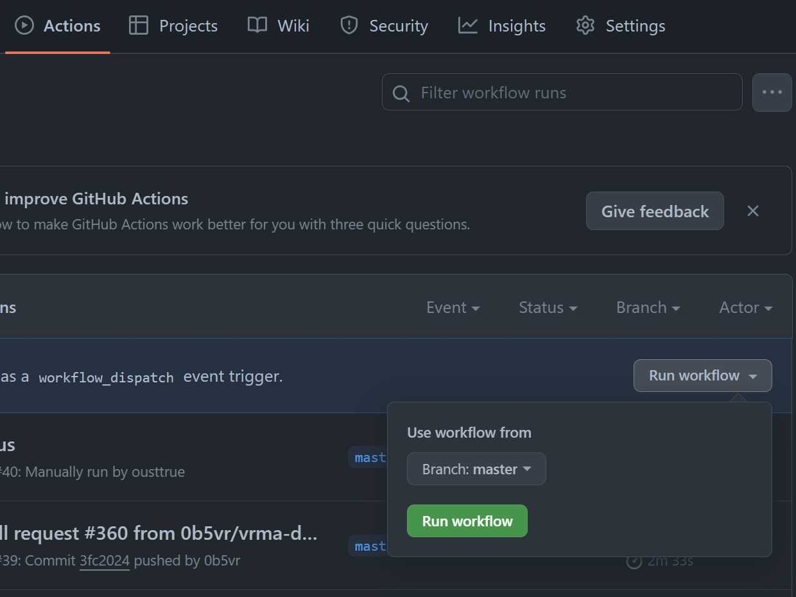

# Translation

We maintain separate docusaurus repositories for each language.
The Japanese version is the original, and the English version is forked.

:::note Changed sphinx's gettext method to fork method

Reference [GitHub as an open source document translation platform (React Japanese documentation example)](https://zenn.dev/smikitky/articles/0d250f7367eda9)

:::

## Japnanese

https://github.com/vrm-c/vrm.dev

Deploy the Japanese version to https://vrm.dev as the base site.

## English

https://github.com/vrm-c/vrm.dev.en

Deploy the English version to https://vrm.dev/en.

:::note Build all at once with github-action

When building a Japanese site
It is built in the `/en` directory.

:::

:::danger 英語版の反映方法

英語版を merge した `次回の日本語版 の github action` でビルドされます。
即座に反映したい場合は、日本語版の reposity の `Actions` - `Docusaurus` - `Run workflow` ボタンを
手動で押してください(緑のボタン)。



:::

## Translation sequence

- The contents of vrm.dev are updated
- Reflect updates in vrm.dev to vrm.dev.en (fetch merge and push). This task is performed regularly (weekly?) by the `vrm.dev` administrator.
  - Untranslated parts will increase
  - There may be a conflict, but if the docusaurus build passes, you can just commit. TODO: Automate
- Translate untranslated parts into English or send an English update PullReq to vrm.dev.en

## Example (on the github website)

TODO:

## Example (Local)

### Start preview

```sh
$ git clone https://github.com/vrm-c/vrm.dev.en.git
$ git switch -c fix/EN_TOPIC # Please give a suitable and unique branch name
$ cd vrm.dev.en
$ npm install
$ npm run dev

# Access https://localhost:3000. View translated article.
```

### Translate with editor

Push `pull request`

## Example (For administrators. Follow-up to Japanese)

TODO: bot automation.

```sh
$ git clone https://github.com/vrm-c/vrm.dev.en.git
$ cd vrm.dev.en
$ git remote add ja https://github.com/vrm-c/vrm.dev

$ git switch -c merge/topic
$ git fetch ja master
$ git merge ja master
$ npm run build

# If there is an error, resolve the conflict and proceed with the build.
# If the build is transparent, you can commit the merge and proceed.

$ git commit
$ git push
```

