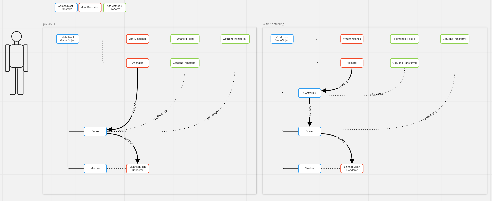

# Humanoid Animation

VRM にモーションを適用する方法

## Unity の humanoid として使う

UnityEngine.Animator に AnimationType が Humanoid の Avatar をセットします。

:::tip
`vrm-0.x` `vrm-1.0` 共に `UnityEngine.Animator` に AnimationType が Humanoid の Avatar を セットアップ済みです。
:::

詳細は Unity を参照してください。

https://docs.unity3d.com/ja/2021.3/Manual/ConfiguringtheAvatar.html

## Transform を操作する

### humanoid bone の回転をコピーする

```cs
foreach(var bone in bones)
{
}
```

:::info
骨格とモーションの初期姿勢が一致するときに可能です。
:::

:::tip vrm-0.x と T-Pose 向けモーション

vrm-0.x はスケルトンが正規化されているので、
初期姿勢が TPose のモーションを適用できます。

:::

:::danger vrm-1.0 は正しく動作しない場合があります

モデルによって異なることに注意してください。
:::

:::warning bvh は vrm-0.x と互換性があるものもあります
BVH の初期姿勢は特に決まっていません。
:::

### vrm-1.0 ControlRig で変換コピーする



[ControlRig](/api/vrm1_controlrig)

:::tip 正規化さていないスケルトン/モーションを変換できます。

:::
