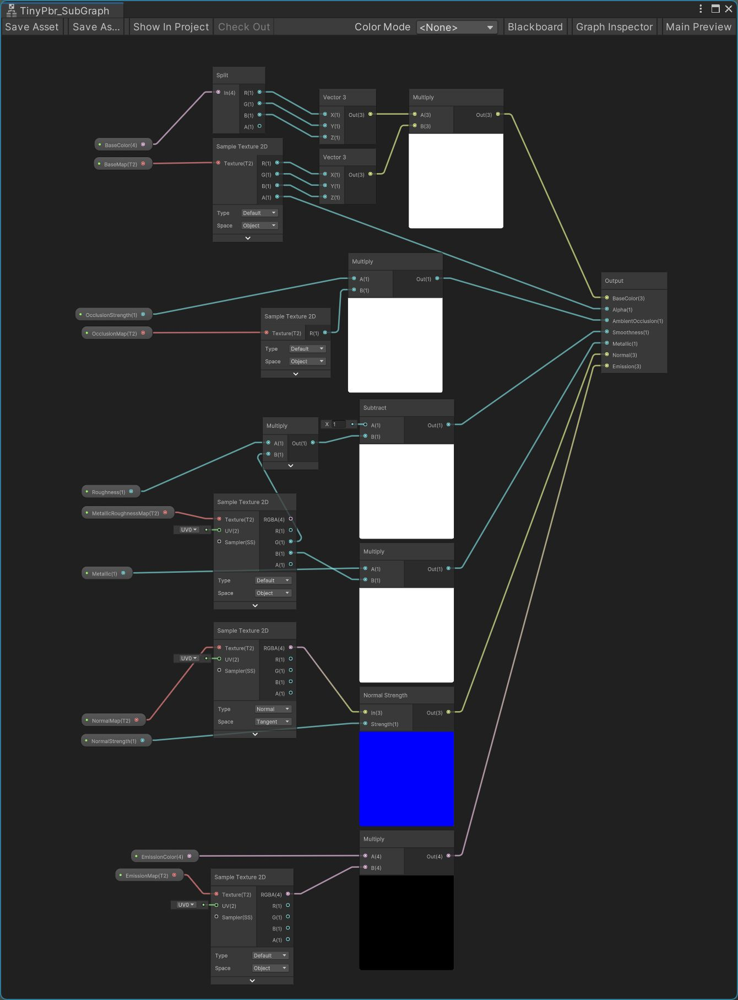

import sg_basecolor from './pbr_shadergraph_basecolor.svg'

# PBR 詳細

下のような Shader を作成します。



:::note glTF material
https://registry.khronos.org/glTF/specs/2.0/glTF-2.0.html#materials
:::

## BaseColor

```js
// glTF の抜粋
{
    "materials": [
        {
            "pbrMetallicRoughness": {
                "baseColorFactor": [ 1.000, 0.766, 0.336, 1.0 ],
                "baseColorTexture": {
                    "index": 0,
                    "texCoord": 1
                },
            }
        }
    ]
}
```


glTF の baseColorFactor と baseColorTexture を、
ShaderGraph の BaseColor と BaseMap に入力します。

```cs title="class TinyPbrMaterialImporter"
        public static async Task ImportBaseColorAsync(GltfData data, glTFMaterial src, TinyPbrMaterialContext context, GetTextureAsyncFunc getTextureAsync, IAwaitCaller awaitCaller)
        {
            var baseColorFactor = GltfMaterialImportUtils.ImportLinearBaseColorFactor(data, src);
            if (baseColorFactor.HasValue)
            {
                context.BaseColorSrgb = baseColorFactor.Value.gamma;
            }

            if (src is { pbrMetallicRoughness: { baseColorTexture: { index: >= 0 } } })
            {
                if (GltfPbrTextureImporter.TryBaseColorTexture(data, src, out _, out var desc))
                {
                    context.BaseTexture = await getTextureAsync(desc, awaitCaller);
                    context.BaseTextureOffset = desc.Offset;
                    context.BaseTextureScale = desc.Scale;
                }
            }
        }
```

### AlphaBlending | Cutoff

## Metallic | Roughness | Occulusion

## Normal

## Emission

## VertexColor

TODO:

## DoubleSided

TODO:
