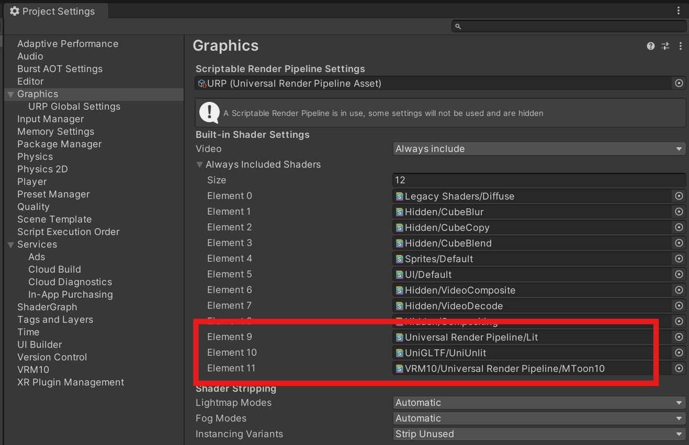

# プロジェクトに含めるシェーダーについて

UniVRM ライブラリを導入しただけでは、ビルド時にシェーダーエラーが発生し、モデルが正常に読み込めません。
なぜなら、アプリ上で読み込む glTF ファイルや VRM ファイルはビルド時には存在しないため、Unity が適切なシェーダをビルドに含めることができないからです。

**ビルドする際は必ず `Project Settings` で `Always Included Shaders` に適切なシェーダを設定してください。**
下記に設定するべきシェーダを記載します。

図: `Project Settings` の `Always Included Shaders` 設定画面。 VRM 1.0 ファイルを URP で扱う場合の例。

:::note シェーダのコンパイル - Unity Documentation
https://docs.unity3d.com/ja/current/Manual/shader-compilation.html
:::

:::note Always Included Shaders - Unity Documentation
https://docs.unity3d.com/ja/2022.3/Manual/class-GraphicsSettings.html#Always
:::

## Built-in Render Pipeline

### glTF ファイルを扱うアプリの場合

`com.vrmc.gltf` パッケージを用いて glTF ファイルを扱うアプリの場合、以下のシェーダをビルドに含める必要があります。

|                    | Built-in RP |
| ------------------ | ----------- |
| `Standard`         | ✅          |
| `UniGLTF/UniUnlit` | ✅          |

### VRM 0.X ファイルを扱うアプリの場合

`com.vrmc.univrm` パッケージを用いて VRM 0.X ファイルを扱うアプリの場合、以下のシェーダをビルドに含める必要があります。

|                    | Built-in RP |
| ------------------ | ----------- |
| `Standard`         | ✅          |
| `UniGLTF/UniUnlit` | ✅          |
| `VRM/MToon`        | ✅          |

### VRM 1.0 ファイルを扱うアプリの場合

`com.vrmc.vrm` パッケージを用いて VRM 1.0 ファイルを扱うアプリの場合、以下のシェーダをビルドに含める必要があります。

|                    | Built-in RP |
| ------------------ | ----------- |
| `Standard`         | ✅          |
| `UniGLTF/UniUnlit` | ✅          |
| `VRM10/MToon10`    | ✅          |

## Universal Render Pipeline(URP)

:::warning `Universal Render Pipeline/Lit` のビルド時間が長大

URP版のPBRシェーダー、 `Universal Render Pipeline/Lit` の初回ビルドに長時間かかることがわかりました。

https://github.com/vrm-c/UniVRM/pull/2498

初回ビルドに長時間(10時間など)かかることにご注意ください。
2回目以降はキャッシュが使用されるのでそこまではかかりません。
ビルド時間軽減のためのカスタムシェーダーを検討中です。
:::

### glTF ファイルを扱うアプリの場合

`com.vrmc.gltf` パッケージを用いて glTF ファイルを扱うアプリの場合、以下のシェーダをビルドに含める必要があります。

|                                | URP |
| ------------------------------ | --- |
| `Univesal Render Pipeline/Lit` | ✅  |
| `UniGLTF/UniUnlit`             | ✅  |

### VRM 0.X ファイルを扱うアプリの場合

`com.vrmc.univrm` パッケージを用いて VRM 0.X ファイルを扱うアプリの場合、以下のシェーダをビルドに含める必要があります。

|                                     | URP |
| ----------------------------------- | --- |
| `Univesal Render Pipeline/Lit`      | ✅  |
| `UniGLTF/UniUnlit`                  | ✅  |
| URP用 MToon シェーダ(not supported) | -   |

### VRM 1.0 ファイルを扱うアプリの場合

`com.vrmc.vrm` パッケージを用いて VRM 1.0 ファイルを扱うアプリの場合、以下のシェーダをビルドに含める必要があります。

|                                           | URP |
| ----------------------------------------- | --- |
| `Univesal Render Pipeline/Lit`            | ✅  |
| `UniGLTF/UniUnlit`                        | ✅  |
| `VRM10/Universal Render Pipeline/MToon10` | ✅  |

## その他シェーダー

:::note

UniGLTF 内部の以下のシェーダは `Resources` ディレクトリに含まれているため、対応の必要はありません。

- `Hidden/UniGLTF/NormalMapExporter`
- `Hidden/UniGLTF/StandardMapExporter`
- `Hidden/UniGLTF/StandardMapImporter`

:::
