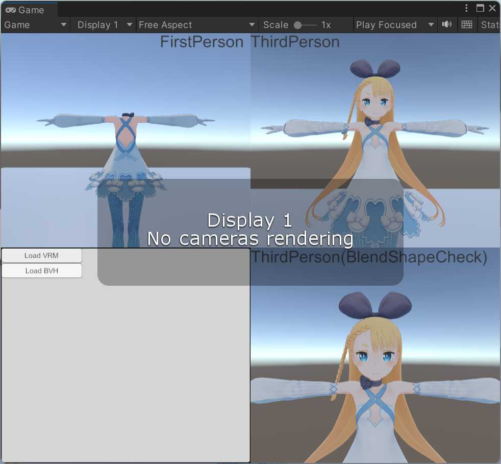

# FirstPersonSample

[Assets/VRM_Samples/FirstPersonSample](https://github.com/vrm-c/UniVRM/tree/master/Assets/VRM_Samples/FirstPersonSample)

VR アプリで FistPerson の設定に合わせて、可視設定を反映するサンプルです。

画面が４分割されて、

- HMDカメラ
- その他のカメラ

の描画を例示します。
