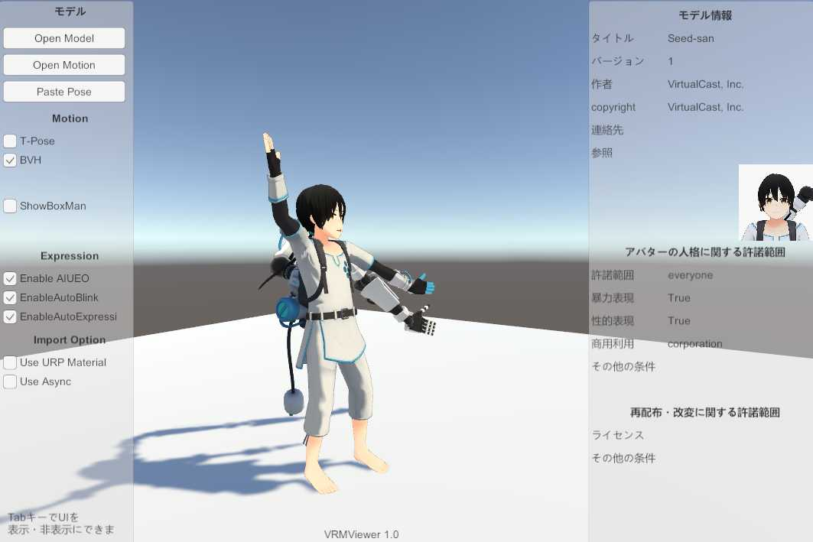

# VRM10Viewer

[Assets/VRM10_Samples/VRM10Viewer](https://github.com/vrm-c/UniVRM/tree/master/Assets/VRM10_Samples/VRM10Viewer)

[WebGL build](https://vrm-c.github.io/UniVRM/VRM10Viewer/)

vrm-1.0 の Runtime ローダーのサンプルです。

以下のフォーマットをロードできます。

- (model) vrm-1.0
- (model) vrm-0.x(vrm-1.0 に動的に変換する)
- (motion) bvh
- (motion) vrm-animation
