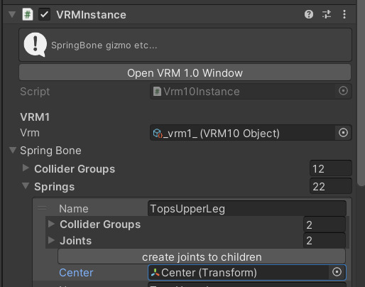

# centerで揺れを抑制する

SpringBoneにはCenterというプロパティが存在し、設定することで揺れを制御することができます。

Centerは、SpringBoneそれぞれに設定することができる、揺れの計算を行う際の相対的な原点を示すプロパティです。
Centerが設定されていない場合、SpringBoneはワールド座標の原点を基準として揺れを計算します。
アプリケーションの実装によっては、ワールド原点ではなく、シーン内の特定のオブジェクトやVRMモデルのルートを基準として揺れが計算されることがあります。

## 平行移動による揺れの抑制

アプリケーション内でVRMモデルが平行移動した際の揺れの抑制を行うには、VRMモデルのルート位置に配置したGameObjectをCenterに設定します。

:::warning
UniVRMの仕様上、VRMモデルのルートとなるGameObjectをCenterに設定することはできません。
これは、VRMモデルのルートがglTF上ではnodeとして扱われないためです。
詳しくは、 [Root Node の仕様](/gltf/root_node) を参照してください。
:::

TODO: 説明GIF

VRMモデルのルート直下にCenterとなる空のGameObjectを作成します。

VRMモデルのルートにある `VRMInstance` コンポーネントの `Spring Bone > Springs` よりSpringBoneの一覧を開き、SpringBoneごとの `Center` に上で作成した空のGameObjectを設定します。

