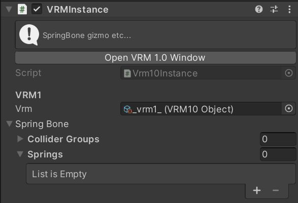
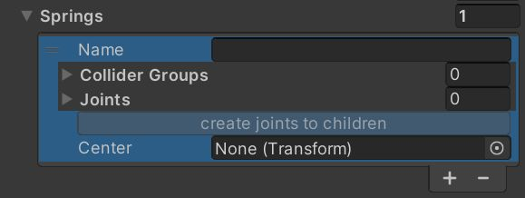
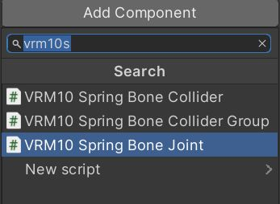
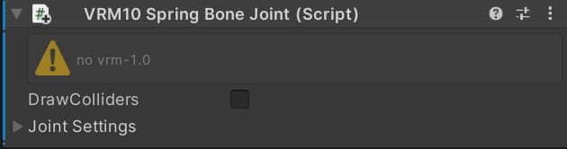
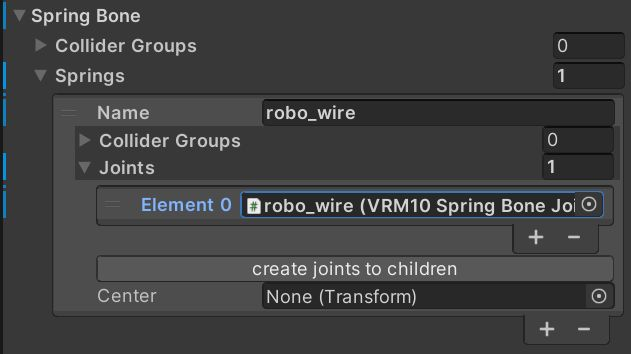
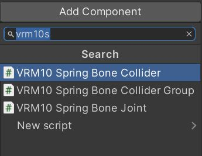
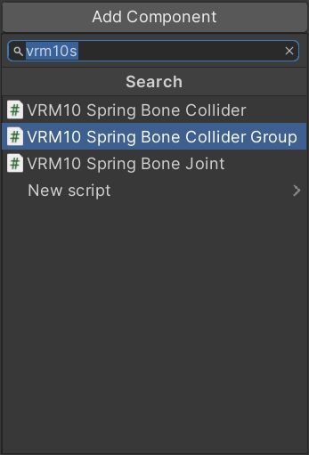
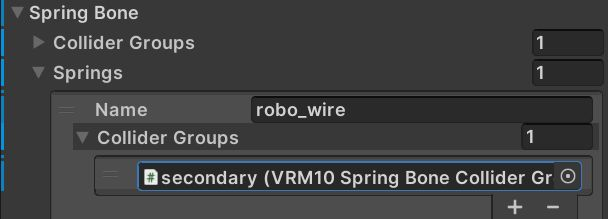
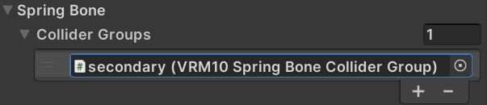

# SpringBone の設定

## Spring の設定場所

Vrm-1.0 のルートGameObjectにアタッチされているVRMInstanceの `Spring Bone` に設定があります。

## Springs に Spring を追加する

:::note
`springs` の `+` を押します。
:::

### Joint コンポーネントをアタッチする

### Spring に Joint を追加する

:::warning

joint が VRMInstance の Spring に登録されていないときに⚠️ が表示されます。
VRMInstance の Spring[x].Joints リストにセットしてください。

:::

### Spring に Center を設定する

SpringBoneにはCenterというプロパティが存在し、設定することで揺れを制御することができます。
詳しくは、 [centerで揺れを抑制する](./center.md) を参照してください。

## SpringBone の Collider

### Collider コンポーネントをアタッチする

### ColliderGroup コンポーネントをアタッチする

### Spring に ColliderGroup を追加する

### ColliderGroups

:::info
vrm1 import 時に自動で更新されるので、手で更新する必要はありません。

`glTF: extensions.VRMC_springBone.colliderGroups` がそのまま表示されます。

TODO: readonly にするなど操作対象でないことがわかるようにする。
:::
