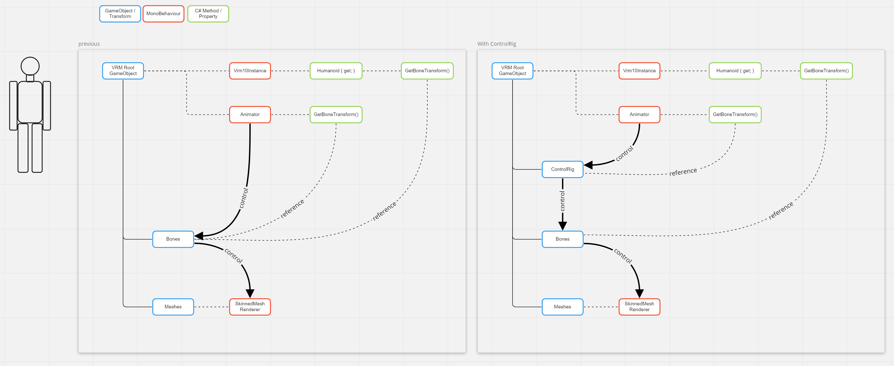

# VRM Animation

## 「VRM アニメーション」とは？

VRM アニメーションは、VRM で定義された人型モデルのアニメーションを記述できます。

- 単一の VRM アニメーションファイルを **あらゆる VRM ファイルで利用できます。**
- フォーマットは**glTF**で記述され、**クロスプラットフォーム**で取り扱うことができます。
- UniVRM を通じて、**Unity で VRM アニメーションを読み書きする標準実装が提供されます。**

## 格納される情報

- **VRM の各コンポーネントととアニメーション対象の glTF ノードを対応付ける情報**が拡張内に定義されています。
  - `VRMC_vrm_animation` という拡張で定義されます。
  - 拡張子として `.vrma` を利用することが推奨されます。
- 🦴 **Humanoid ボーンアニメーション**を記述可能です。
  - glTF ノードがどの Humanoid ボーンに対応するかを拡張内で記述します。
  - アニメーションで定義されたボーン回転を宛先となる VRM に適切に反映するよう、回転の変換を行うことを実装に期待します。
- 😄 **表情アニメーション**を記述可能です。
  - 表情のウェイトを glTF ノードの座標に変換した状態で保持します。
  - VRM で定義されたプリセット表情のほか、宛先 VRM に相当する表情が定義されていればカスタム表情についても反映が可能です。
- 👀 **視線制御アニメーション**を記述可能です。
  - 視線がどの方向に向くべきかを表す glTF ノードを拡張内で指定します。

## VRM アニメーションでできること

VRM アニメーションを利用することで、人型モデルに対するアニメーションを**アプリケーションやモデルをまたいで利用できます。**

例えば、以下のような使い方が想定されます。

- VRM アニメーションに対応したオーサリングツールを利用して、アニメーションを作成する
- モーションキャプチャで記録したアニメーションをさまざまなアプリケーションで利用する
- 作ったアニメーションを配信アプリや撮影アプリで再生する
- 作ったアニメーションをメタバースに持っていって再生するほか、他のユーザとシェアして一緒に使う
- VRM アニメーションファイルをゲームエンジンで読み込み、ゲーム等の開発で利用する

## VRM アニメーションを利用したアプリケーションを開発する

VRM-1.0 に、VRM-Animation サポートが実装されています。

## 仕様

https://github.com/vrm-c/vrm-specification/tree/master/specification/VRMC_vrm_animation-1.0

:::tip 正規化さていないスケルトン/モーションを変換できます。

[ControlRig](/api/humanoid/Vrm10RuntimeControlRig/)

:::
